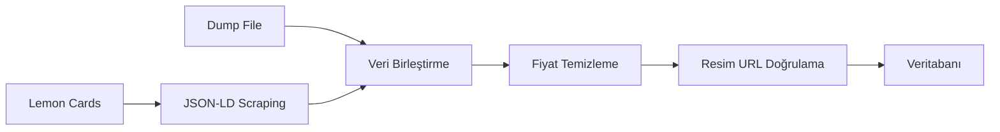

# Scraper Komutları Kullanım Kılavuzu

Bu döküman, Lemon Cards scraper'ı ve ilgili scriptlerin nasıl kullanılacağını açıklar.

## İçindekiler

1. [Debug Scraper](#debug-scraper)
2. [Load Lemon Cards](#load-lemon-cards)
3. [Veri Yapısı](#veri-yapısı)
4. [Yaygın İşlemler](#yaygın-işlemler)

---

## Debug Scraper

### Amaç
`debug-scraper.ts` scripti, scraper'ın doğru çalışıp çalışmadığını test etmek, DOM yapısını incelemek ve farklı sayfaların içeriğini karşılaştırmak için kullanılır.

### Nasıl Çalıştırılır

```bash
npx tsx scripts/debug-scraper.ts
```

### Ne Yapar

1. **Scraper Testi**: `LemonCardsScraper` sınıfını çalıştırır ve örnek veri çeker
2. **Sayfa Karşılaştırması**: Sayfa 1 ve Sayfa 2'nin DOM içeriğini karşılaştırır
3. **Next.js Data Extraction**: Next.js buildId'sini bulur ve data endpoint'ini test eder

### Çıktı Yorumlama

```
Testing LemonCardsScraper...
Scraping category: /tekli-kartlar
  Found 48 cards in /tekli-kartlar
Scraping category: /pokemon-tcg-1
  Found 48 cards in /pokemon-tcg-1
...
Total cards scraped: 336
Found 336 cards.
```

- **Başarılı Durum**: Her kategori için kart sayısı görünüyorsa scraper düzgün çalışıyor demektir
- **Hata Durumu**: "Failed to fetch" mesajları varsa, URL'lerde sorun olabilir
- **Boş Sonuç**: "No cards found" mesajı alınırsa, HTML yapısı değişmiş olabilir

### Kullanım Senaryoları

- ✅ Yeni kategori ekledikten sonra test etmek için
- ✅ Scraper'ın hala çalışıp çalışmadığını kontrol etmek için
- ✅ Lemon Cards sitesinde değişiklik olup olmadığını görmek için

---

## Load Lemon Cards

### Amaç
`load-lemon-cards.ts` scripti, Lemon Cards'tan ürün verilerini çekip veritabanına yükler.

### Ön Koşullar

`.env.local` dosyasında veritabanı bağlantı bilgileri olmalı:

```env
POSTGRES_URL="postgresql://..."
DATABASE_URL="postgresql://..."
```

### Nasıl Çalıştırılır

```bash
npx tsx scripts/load-lemon-cards.ts
```

### Veri Akışı



#### Adım Adım Süreç

1. **JSON-LD Scraping**: Sayfa 1'den yüksek kaliteli veri çeker (JSON-LD structured data kullanarak)
2. **Dump File Okuma**: Varsa `lemon_cards_dump_full.json` dosyasını okur (Sayfa 1-10 verisi)
3. **Veri Birleştirme**: İki kaynaktaki verileri product_url'e göre birleştirir (JSON-LD verisi önceliklidir)
4. **Fiyat Temizleme**: 
   - "1.234,56 TL" formatındaki fiyatları decimal formata çevirir
   - Zaten decimal formattaki fiyatları (60.00) direkt kullanır
5. **Resim URL Kontrolü**: Base64 placeholder resimleri atar
6. **Veritabanı İşlemleri**:
   - Fiyatı olmayan kartları temizler
   - Mevcut kartları günceller (fiyat ve resim)
   - Yeni kartları ekler

### Çıktı Örneği

```
Starting Lemon Cards load process...
Cards table columns: [ 'id', 'name', 'game', 'price', 'currency', 'seller_name', 'image_url', 'product_url', 'last_updated' ]
Fetching Page 1 data via JSON-LD...
Scraping category: /tekli-kartlar
  Found 48 cards in /tekli-kartlar
Scraping category: /pokemon-tcg-1
  Found 48 cards in /pokemon-tcg-1
...
Total cards scraped: 336
Fetched 336 cards from Page 1 (High Quality).
Loaded 480 cards from dump file.
Total unique cards to insert: 650
Cleaning up cards with no price...
Load complete. Inserted 245 new cards.
```

### Hata Ayıklama İpuçları

**Sorun**: `.env.local` okunamıyor
```
POSTGRES_URL defined after manual load: false
```
**Çözüm**: `.env.local` dosyasının proje kök dizininde olduğundan emin olun

**Sorun**: Kartlar eklenemedi
```
Error inserting card Pokemon Card: ...
```
**Çözüm**: Veritabanı şemasının doğru olup olmadığını kontrol edin:
```bash
npx tsx scripts/verify-db.ts
```

**Sorun**: Tüm kartlar atlandı (skipped)
```
Load complete. Inserted 0 new cards.
```
**Çözüm**: Dump dosyasındaki veya scrape edilen verilerdeki fiyat formatını kontrol edin

---

## Veri Yapısı

### Card Interface

```typescript
interface Card {
    seller_name: string;      // "Lemon Cards"
    game: string;             // "Pokemon", "Magic: The Gathering", vb.
    name: string;             // Kart adı
    price: number | null;     // TL cinsinden fiyat (decimal)
    currency: string;         // "TRY"
    image_url: string | null; // Kart resim URL'i
    product_url: string;      // Ürün sayfası URL'i
}
```

### Oyun Kategorileri

Scraper şu kategorilerden veri çeker:

| Kategori URL | Oyun |
|--------------|------|
| `/tekli-kartlar` | Karışık (otomatik tespit edilir) |
| `/pokemon-tcg-1` | Pokemon |
| `/one-piece-tcg` | One Piece |
| `/disney-lorcana-1` | Lorcana |
| `/yugioh-tcg` | Yu-Gi-Oh! |
| `/magic--the-gathering` | Magic: The Gathering |
| `/wixoss` | WIXOSS |

### Oyun Çıkarımı (Game Inference)

Scraper, kartın hangi oyuna ait olduğunu iki yöntemle belirler:

1. **Kategori URL'den** (öncelikli): URL'de oyun adı varsa direkt kullanır
2. **Kart adından** (yedek): Kart adında oyun ismi geçiyorsa tespit eder

Örnek:
- `/pokemon-tcg-1` kategorisinden gelen tüm kartlar → `"Pokemon"`
- Kart adı "Pikachu VMAX" → `"Pokemon"`
- Kart adı "Black Lotus" → `"Magic: The Gathering"`

---

## Yaygın İşlemler

### 1. İlk Kez Veri Çekme

```bash
# 1. Scraper'ı test et
npx tsx scripts/debug-scraper.ts

# 2. Veritabanına yükle
npx tsx scripts/load-lemon-cards.ts

# 3. Veritabanını doğrula
npx tsx scripts/verify-db.ts
```

### 2. Mevcut Verileri Güncelleme

```bash
# Fiyatları güncellemek için load scriptini tekrar çalıştır
npx tsx scripts/load-lemon-cards.ts
```

Script otomatik olarak:
- Mevcut kartların fiyatlarını günceller
- Yeni kartları ekler
- Eksik resimleri tamamlar

### 3. Scraper Sorunlarını Giderme

**Adım 1**: Debug scraper'ı çalıştır
```bash
npx tsx scripts/debug-scraper.ts
```

**Adım 2**: Çıktıyı kontrol et
- Her kategoriden kart geldi mi?
- JSON-LD data bulundu mu?
- HTTP hataları var mı?

**Adım 3**: Gerekirse manuel test
```bash
curl https://lemoncards.com.tr/pokemon-tcg-1
```

### 4. Veri Kalitesini Doğrulama

```bash
# Veritabanındaki veriyi kontrol et
npx tsx scripts/verify-db.ts
```

Kontrol edilecekler:
- ✅ Tüm kartların fiyatı var mı?
- ✅ Resim URL'leri geçerli mi?
- ✅ Oyun kategorileri doğru atanmış mı?
- ✅ Duplicate kayıt var mı?

### 5. Yeni Kategori Ekleme

1. `lib/scraper/lemon-cards.ts` dosyasını aç
2. `categories` dizisine yeni URL'i ekle:
   ```typescript
   private categories = [
       '/tekli-kartlar',
       '/pokemon-tcg-1',
       // ... mevcut kategoriler
       '/yeni-kategori'  // ← yeni kategori
   ];
   ```
3. Gerekirse `inferGame()` metoduna yeni oyun tanımlaması ekle
4. Test et:
   ```bash
   npx tsx scripts/debug-scraper.ts
   ```

---

## Sık Karşılaşılan Hatalar

### "Failed to fetch" Hatası

**Sebep**: Lemon Cards sitesi erişilebilir değil veya URL yanlış

**Çözüm**:
```bash
# Site erişilebilir mi kontrol et
curl -I https://lemoncards.com.tr/pokemon-tcg-1
```

### "JSON-LD ItemList not found" Uyarısı

**Sebep**: Sayfanın HTML yapısı değişmiş olabilir

**Çözüm**: 
- Tarayıcıda sayfayı aç ve "View Page Source" yap
- `<script type="application/ld+json">` tag'ini ara
- Yapı değiştiyse scraper kodunu güncelle

### Duplicate Key Hatası

**Sebep**: Aynı product_url ile birden fazla insert

**Çözüm**:
```bash
# Duplicate kayıtları temizle
npx tsx scripts/fix-duplicates.ts
```

---

## Notlar

- Scraper her çalıştırıldığında ~336 kart (7 kategori × ~48 kart) getirir
- Pagination henüz desteklenmiyor, sadece her kategorinin ilk sayfası çekiliyor
- Dump file opsiyoneldir, yoksa sadece JSON-LD ile devam eder
- Fiyatı olmayan kartlar otomatik olarak atlanır

## Katkıda Bulunma

Yeni özellik eklemek veya hata düzeltmek için:
1. `debug-scraper.ts` ile test yap
2. Değişiklikleri `lemon-cards.ts`'e uygula
3. `load-lemon-cards.ts` ile veritabanına yükle
4. `verify-db.ts` ile doğrula

---

**Son Güncelleme**: 29 Kasım 2025
